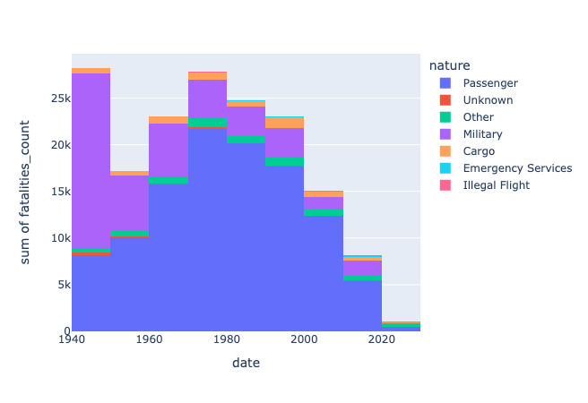
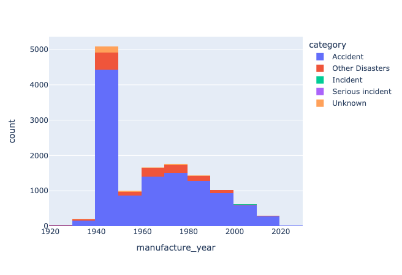

# Aviation Crawler
> [!WARNING]
> This Web Crawler is purely for educational purposes - all data is property of [Flight Safety Foundation](https://flightsafety.org). 

## Introduction

### ASN Database

The [Aviation Safety Network](https://aviation-safety.net) Database is updated daily and contains descriptions of airlines, military transport category aircrafts and corporate jet aircrafts safety occurrences since 1919. Airliners considered are capable of carrying at least 12 passengers.

### Scrapy Crawler

This web crawler is designed to scrape websites into a structured json file for further exploratory data analysis for educational purposes. 

The crawler used is called [Scrapy](https://github.com/scrapy/scrapy) and it is a web-scraping framework designed to crawl websites and extract structured data from their pages. More information can be found on the [Scrapy Homepage](https://scrapy.org/)

## Item Pipelines
Item pipelines were used to clean the extracted data before being dumped onto a json file.

The "ID" column were cleaned to only include the wikibase number and "accident_location" was cleaned to ensure that "-\n\t" was not included in the final output. 

In addition the Fatalities columns was split into two other columns each designating the number of fatalities and the number of occupants. This is to distinguish the difference in casualties. 

The phase, registration and MSN columns was observed to contain trailing spaces - these were cleaned using a simple strip function.

Next was to convert the date column from string to DateTime.

The cleaned dataset was then uploaded into PostgreSQL. A copy of the dataset was also saved in the repository as aviaition_database_output_cleaned. 

The next step is to perform exploratory data analysis (EDA) on the data to gather insights and perform more data cleaning if required. 

### Exploratory Data Analysis
The scraped dataset consists of 33582 records of aircraft incidents and 23 features.

These are 'id', 'date', 'occupants_count', 'fatalities_count', 'location', 'url',
'confidence_rating', 'investigating_agency', 'depature_airport' 'destination_airport', 'nature', 'phase', 'category', 'aircraft_damage',
'other_fatalities', 'cycles', 'total_airframe_hours', 'engine_model',
'manufacture_year', 'msn', 'registration', 'owner_operator', and 'type'

Lets first take a look at the sum of all fatalities by the nature of the aicraft within a ten year span. 

We can observe that when comparing the two highest group of years, 1940 to 1949 contained more accidents of military aircraft and between 1970 to 1979 contained more accidents with passenger aircraft.

Now lets take a look at the manufacture year of the aircraft by the accident category within a ten year span.

We can observe that most of aircraft accidents occured between 1940 and 1949. 

